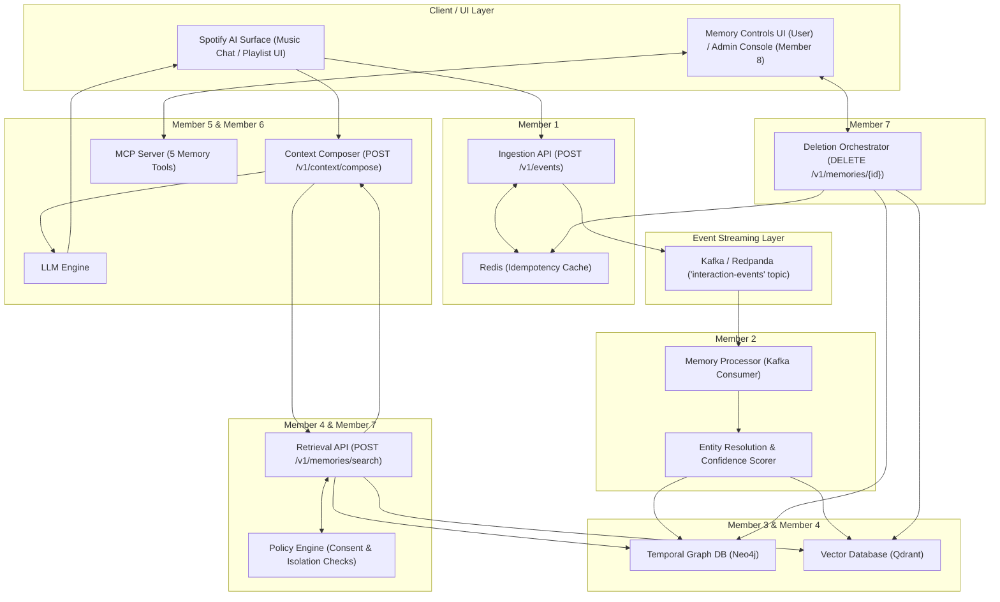

# 🎧 Spotify Personalized AI Memory System

> A governed, enterprise-grade memory layer for Spotify AI experiences. Enables Spotify AI to remember durable preferences and past interactions safely while supporting strict privacy controls, temporal graph updates, vector similarity retrieval, Model Context Protocol (MCP) tools, and cross-store deletions.

---

## 🏗 System Architecture



---

## 🛠 Local Setup & Installation

### Prerequisites
- **Docker & Docker Compose** installed
- **Python 3.10+**
- **Node.js 18+** (for frontend applications)

### 1. Clone & Configure Environment
```bash
cp .env.example .env
```

### 2. Launch Local Infrastructure Stack
Start PostgreSQL, Neo4j, Redis, Redpanda (Kafka), and Qdrant:
```bash
docker-compose up -d
```

### 3. Install Shared Python Contracts
```bash
cd packages/contracts
pip install -e .
cd ../..
```

---

## 📡 REST API Specifications

The system exposes the following REST APIs:

| Endpoint | Method | Service / Owner | Description |
| :--- | :--- | :--- | :--- |
| `/v1/events` | `POST` | Ingestion API (Member 1) | Ingest interaction events; validates schema & consent, checks Redis idempotency, pushes to Kafka. |
| `/v1/memories/extract` | `POST` | Memory Processor (Member 2) | Synchronous memory extraction & entity resolution for testing. |
| `/v1/memories/search` | `POST` | Retrieval API (Member 4) | Hybrid search (Graph + Vector similarity reranking). |
| `/v1/context/compose` | `POST` | Context Composer (Member 5) | Packages relevant memories safely into bounded context blocks for LLM prompts. |
| `/v1/memories/{memory_id}` | `PATCH` | Deletion & Policy (Member 7) | Correct, supersede, or update memory validity. |
| `/v1/memories/{memory_id}` | `DELETE` | Deletion & Policy (Member 7) | Multi-store purge (Neo4j, Qdrant, Redis, Postgres). |
| `/v1/deletions/{job_id}` | `GET` | Deletion & Policy (Member 7) | Track cross-store deletion job status. |
| `/v1/feedback` | `POST` | Context Composer (Member 5) | Capture user relevance signals & corrections. |

---

## 🔌 Model Context Protocol (MCP) Tools

Exposed by the **MCP Server** (`services/memory-mcp-server/` — Member 6):

1. `search_memory(subject_id, query)`: Search memories using hybrid retrieval.
2. `add_explicit_preference(subject_id, fact_text)`: Create explicit preference memories.
3. `correct_memory(memory_id, new_fact_text)`: Supersede an old memory with a corrected fact without destroying history.
4. `delete_memory(memory_id)`: Trigger a multi-store deletion job.
5. `explain_memory_use(memory_id)`: Return provenance & justification for why a memory was used in an AI response.

---

## 🖼 Application Screenshots & UI Interfaces

### User Memory Controls (`apps/memory-controls/`)
- User-facing memory control panel displaying **"What we remember about you"**.
- Allows users to review, correct, pause, or delete saved preferences in plain language.

### Internal Admin & Observability Console (`apps/memory-console/`)
- Subject-scoped memory explorer displaying graph relationships, confidence scores, and provenance.
- Context Preview simulator to inspect candidate retrieval and ranking scores.

---

## ⚠️ Known Limitations & Design Trade-offs

1. **V1 Entity Resolution**: Uses canonical dictionary matching for Spotify artists, playlists, and topics. Advanced dynamic entity linking is scheduled for V2.
2. **Synchronous Vector Indexing**: Embeddings are generated immediately upon memory approval; high-throughput async batch embedding generation is planned for scale testing.
3. **Local Docker Environment**: Designed for local development with Redpanda (Kafka compatible) and single-node Neo4j community edition.

---

## 👥 Team Contribution Ownership Matrix

This project is built and maintained by **9 Team Member Roles**:

| Member | Assigned Component / Directory | Primary Ownership & Responsibilities |
| :--- | :--- | :--- |
| **👑 Lead (You)** | `packages/contracts/`, Root | Architecture blueprint, shared Pydantic models, Docker setup, pipeline spec. |
| **Member 1** | `services/ingestion-api/` | Event ingestion, schema validation, Redis idempotency check, Kafka producer. |
| **Member 2** | `services/memory-processor/` | Kafka consumer worker, memory classification, entity resolution, confidence scoring. |
| **Member 3** | `packages/graph-schema/` | Neo4j temporal graph storage, provenance linking, Cypher query optimization. |
| **Member 4** | `services/retrieval-api/` | SentenceTransformers embeddings, Qdrant vector index, hybrid ranking algorithm. |
| **Member 5** | `services/context-composer/` | Prompt-injection proof context packaging, token budget enforcement, LLM chat. |
| **Member 6** | `services/memory-mcp-server/` | Dedicated FastMCP tool server with authentication & rate limiting. |
| **Member 7** | `services/deletion-orchestrator/` & `packages/policy-engine/` | Cross-store privacy deletion, consent enforcement, tenant isolation security checks. |
| **Member 8** | `apps/memory-controls/` & `apps/memory-console/` | Next.js/React User Memory Controls sidebar & Internal Admin Console. |
